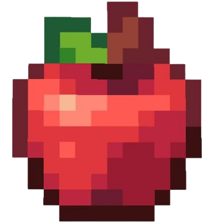

# 🎀 Real-Time Team Productivity Dashboard
[](https://www.docker.com/) 


A simple full-stack application for task management and real-time team metrics.
Includes frontend, backend, and database, with local deployment via Docker Compose.

## 🧰 Stack 

- Frontend: React, Socket.IO Client 
- Backend: Node.js, Express, Socket.IO, Mongoose 
- Infraestructure: MongoDB, Docker, Docker Compose 

## ✨ Features 

- Task list with CRUD operations
- Productivity metrics and charts
- Real-time updates with Socket.IO events
- Sample data seeding for quick testing

## 🏗️ Structure
```
productivity-dashboard/
├── docker-compose.yml
├── productivity-dashboard-backend/
│   ├── controllers/
│   ├── models/
│   ├── routes/
│   ├── seed.js
│   └── sample_data.json
└── productivity-dashboard-frontend/
    ├── src/
    └── public/
```

## 🚀 Quick run

```
bash
git clone https://github.com/yiiingye/productivity-dashboard.git
cd productivity-dashboard
docker compose up --build
```

Services: 
- Frontend: http://localhost:3000 
- Backend: http://localhost:5000 

Seed data:
```
bash
docker exec -it backend npm run seed
```

##  Screenshots

###  Task list


###  Charts


###  Add task


